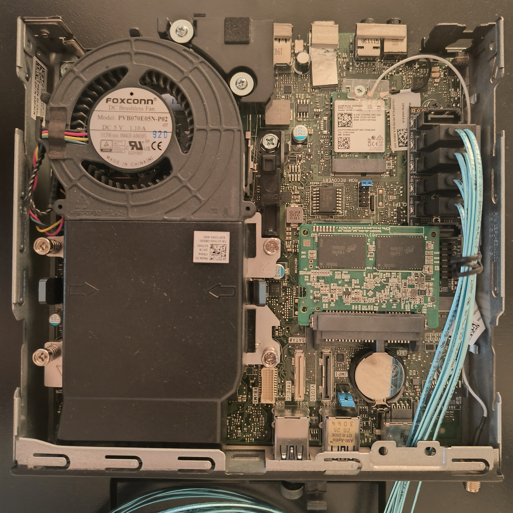
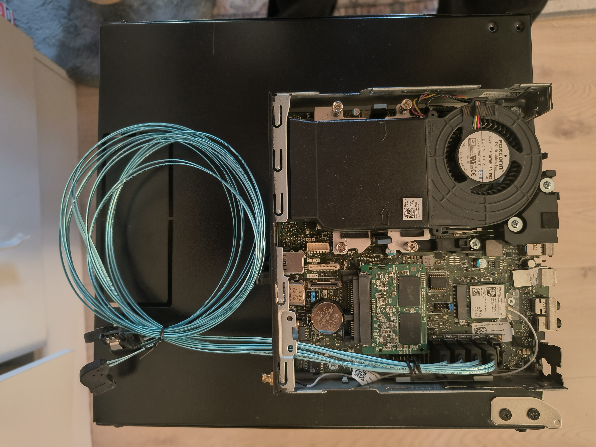

# The little rack that could

In no small part inspired by Jeff Geerlings [Project MINI RACK](https://mini-rack.jeffgeerling.com/)

## Parts list

[TOTEN WS WS.3309.9001](https://www.multicom.no/toten-ws-ws33099001-skap-9u/cat-p/c/p3688727)  
Cheapest rack i could find that fit my needs. 

[Digitus Professional DN-91420](https://www.multicom.no/digitus-professional-dn-91420-pluggbord-blankt/cat-p/c/p10043373)  
I found that 3D printed patch panels flexed a bit to much.

[Digitus Dn-10-tray-2 Rack Shelf 1U 10" Black](https://www.multicom.no/digitus-dn-10-tray-2-rack-shelf-1u/cat-p/c/p1001747923)  
Shelf for holding the Optiplex

[3D printed hot swap 3.5 drive bays](https://makerworld.com/en/models/1400538-10-inch-rack-1u-2-x-3-5-inch-hdd-hot-swap#profileId-3241847)  
Very smart 3D printed HDD enclosure that fits poweredge caddys.

[Rasberry Pi + TP-link SG105](https://makerworld.com/en/models/1495240-pi-3b-4b-5b-tp-link-sg105-mx-sw-10-rack-mount#profileId-1577663)  
Perfect fit!

[DC5525 To SATA-Power](https://www.aliexpress.com/item/1005010336578998.html?spm=a2g0o.order_list.order_list_main.5.83bd1802DXZjXd)  
Coupled with a 12v 8A adapter. 

[M.2 to 6xSATA](https://www.aliexpress.com/item/1005008295170254.html?spm=a2g0o.order_list.order_list_main.50.83bd1802DXZjXd)  
The OptiPlex 7060 only has one internal SATA port. 

[SATA Male to female adapter](https://www.aliexpress.com/item/1005010151565323.html?spm=a2g0o.order_list.order_list_main.55.83bd1802DXZjXd)  
Screws into the back of the HDD bay.

[Poweredge Caddy](https://www.aliexpress.com/item/1005007524725982.html?spm=a2g0o.order_list.order_list_main.100.83bd1802DXZjXd)  
Fits in the HDD bays

[Usb fan](https://www.aliexpress.com/item/1005005961780007.html?spm=a2g0o.order_list.order_list_main.15.83bd1802DXZjXd)  
Because i do not have any fan headers inside the rack

## HARDWARE

    Rasberry Pi 5
        Portainer:
            Pihole
            ZNC
            Tailscale
            Glance
            Nginx proxy manager

    Dell OptiPlex 7060 Micro
        Truenas:
            Navidrome
            Immich
            Home assistant

## Optiplex 7060
#### The boot drive is an old SSD i had laying around. Some smaller SSDs dont use the entire 2.5" enclosure so removing it made it possible to fit it and use the m.2 to 6xSATA adapter.

#### The SATA cables i used was sadly not low profile enough and some modifications had to be done to make the cover fit back on.

It currently has some spare HDDs in it. Pending HDD prices to get reasonable.  

https://www.dell.com/community/en/conversations/optiplex-desktops/optiplex-micro-as-a-low-cost-6-bay-nas/647f9a6af4ccf8a8dee0e6fb

